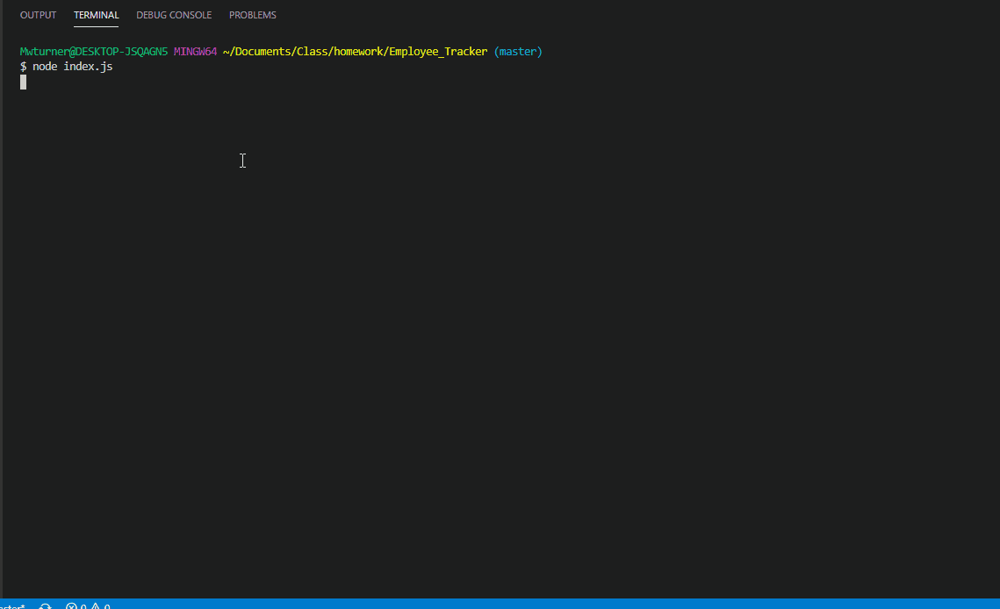

# Employee_Tracker
###### Description

A simple command line application to SELECT/UPDATE/ADD employee info to and from a MySQL database

# Technologies Used
* Node.js
* mySQL
* JavaScript
* NPM  - "inquirer"
* NPM - "figlet"
* NPM - "console.table"
* NPM - "mysql"

# Demo

## Table of Contents (Optional)
* [Top of Page](#description)
* [Technologies Used](#technologies)
* [Gif](#demo)
* [Installation](#installation)
* [Usage](#usage)
* [License](#license)
* [Contributing](#contributing)
* [Tests](#tests)
* [Contacts](#contacts)

## Installation
1. Application requires a link to mySQL database
2. Update all specifics of SQL connection on the "query.js" file
3. Open the sql folder and run the "Schema.sql" file in your mySQL database to begin
4. Use the seed file as a guide to how you would load your initial set of data
5. npm install to get packages
6. In the command line, preferably bash, run "node index.js" to begin

## Usage 
1. From command line type node index.js
2. Follow the View prompt to View various reports on Roles, Departments and Employees
3. Follow the Add prompt to Add a Role, Department or Employee
4. Follow the Transfer prompt to move an employee to a new position

## License
This project is licensed under The MIT License.

## Contributing
All contributions and suggestions are welcome! For direct contributions, please fork the repository and file a pull request.

## Contacts

* Name: Matt Turner (mwturner611)
* e-mail: mwturner611@gmail.com
* [LinkedIn](https://www.linkedin.com/in/matt-turner-ba328211a/)
